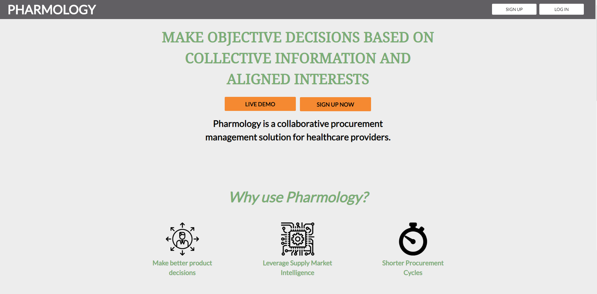
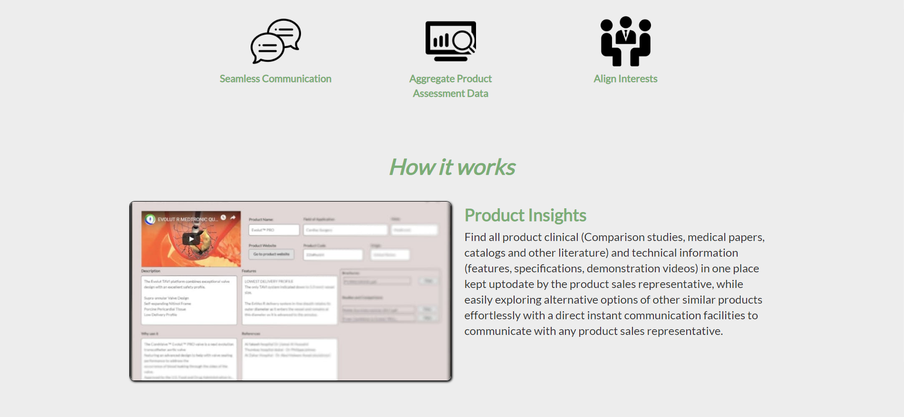
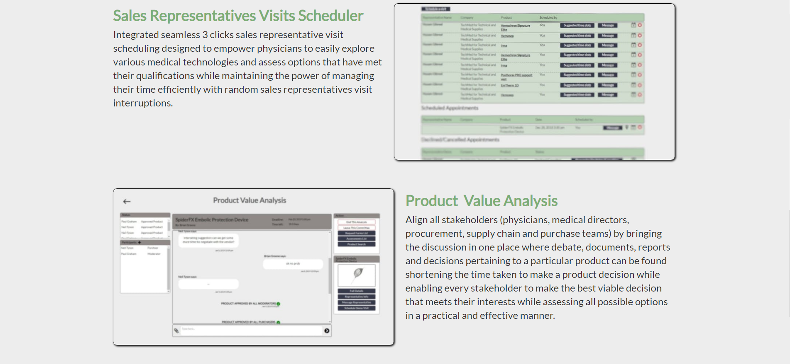
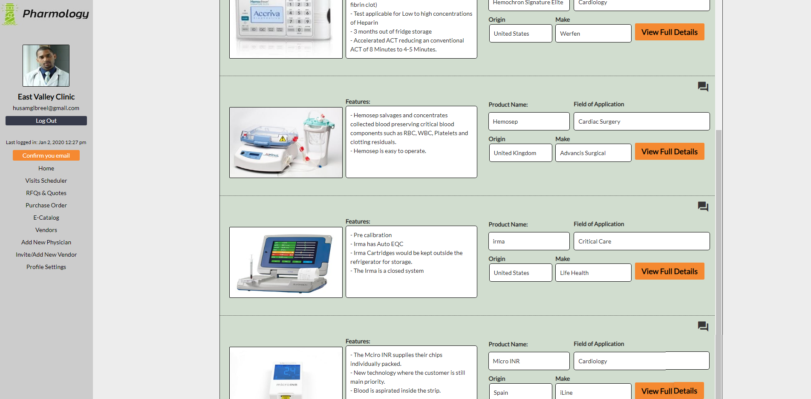

#  [Pharmology](https://pharmology.bubbleapps.io/) Web App

A collaborative procurement management solution for healthcare providers.

check out the App [**here**](https://pharmology.bubbleapps.io/)

## Introduction

A cloud based procurement management solution made specifically for healthcare institutions, which allows hospitals/clinics to send RFQs and POs and receive quotations and invoices 50% faster, increasing their capacity to assess more vendors, which leads to increased competition and ultimately reduced medical supplies cost.

## Screenshot

---

## Components

### Visits Scheduler
- Manages vendor's sales visits to the physician's office.

### RFQs and Quotes Manager
- Streamlines the processing of rquest for quotations (RFQs) and quotes between the hospital and vendors.

### Purchase orders manager
- Streamlines the processing of purchase orders.
- Enables hospitals to actively track the status of their orders and take action on delays.

### E-Catalog
- Provides physicians and procurement teams access to all the medical equipment products available by vendors on the platform.

### Vendors Database
- Provides physicians and procurement teams access to a database of all the vendors in the region that includes the products they offer, reviews by other hospitals and physicians, product reviews and ratings by physicians, etc.

### Stack

#### Front-end  
- [Bubble.io](https://bubble.io/)

#### Back-end
- [Bubble.io](https://bubble.io/)
- [One-Signal](https://onesignal.com/) for push notifications.
- [Sendgrid](https://app.sendgrid.com/) for email delivery.
- [Firebase Authentication](https://firebase.google.com/products/auth/) for multi-platform user atuhentication.

#### Database
- [Bubble.io](https://bubble.io/)

### Blog